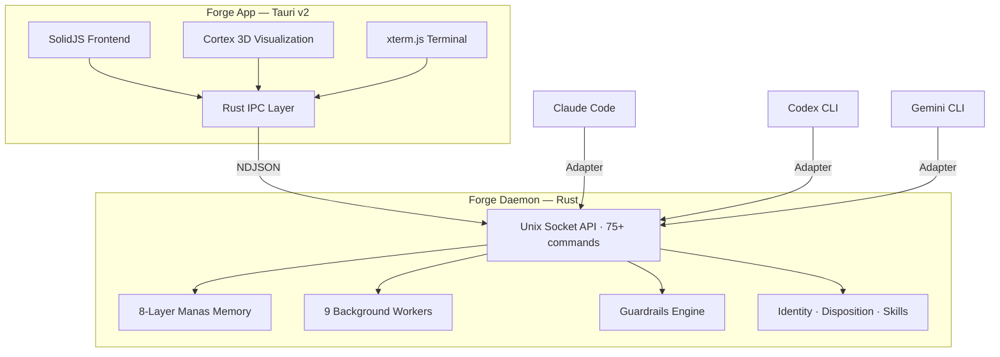

<p align="center">
  
</p>

<h1 align="center">Forge</h1>

<p align="center">
  <strong>Cognitive infrastructure for AI agents.</strong>
</p>

<p align="center">
  Persistent memory. Intelligent guardrails. Self-healing knowledge graph.<br/>
  One daemon. Any agent. Install once, remember everything.
</p>

<p align="center">
  <a href="https://forge.bhairavi.tech">Website</a> &middot;
  <a href="https://github.com/chaosmaximus/forge/discussions">Discussions</a> &middot;
  <a href="https://github.com/sponsors/chaosmaximus">Sponsor</a>
</p>

<p align="center">
  
  
  
  
  
  
</p>

---

<p align="center">
  <em>Demo recording coming soon — <a href="https://forge.bhairavi.tech">visit the website</a> for screenshots and details.</em>
</p>

---

## The Problem

AI agents forget everything. Every session starts from zero. You explain your auth strategy, your database schema, your deployment pipeline — and next session, it's gone. You maintain `MEMORY.md` files by hand. You copy-paste context. You repeat yourself endlessly.

Your agent has the reasoning power of a senior engineer and the memory of a goldfish.

## The Solution

Forge is an always-on daemon that gives AI agents persistent memory, intelligent guardrails, and a self-healing knowledge graph. Install it, bootstrap from your existing transcripts, and your agent remembers everything — across sessions, across projects, across machines.

**Install. Bootstrap. 100 memories in 60 seconds.**

---

## Quick Start

```bash
# 1. Install
curl -fsSL https://forge.bhairavi.tech/install.sh | sh

# 2. Bootstrap from your existing Claude Code / Codex / Cursor transcripts
forge-next bootstrap

#    ███████████████████████████░░░  Processing 47 sessions...
#    ✓ 143 memories extracted in 58s

# 3. Search your memory
forge-next recall "auth"

#    ╭──────────────────────────────────────────────────╮
#    │ [decision] Use JWT with RS256 signing keys       │
#    │ project: api-server  confidence: 0.94            │
#    │ Rotating keys stored in Vault, 24h expiry.       │
#    │ 3 linked files · 2 related decisions             │
#    ╰──────────────────────────────────────────────────╯

# 4. Your agent gets this context automatically on next session start
```

The daemon runs in the background. You never start it manually. It extracts memories from every agent session, builds a knowledge graph, and injects relevant context when your agent needs it.

---

## How It Works



**The agent never writes to memory.** Extraction happens silently in the background. The agent only needs to recall. The graph grows automatically.

---

## Features

<table>
<tr>
<td width="50%" valign="top">

### Memory
- **8-layer knowledge graph** with SQLite FTS5 + vector search
- **Auto-extraction** from agent transcripts (zero manual tagging)
- **Multi-provider** — Ollama (local), Claude, OpenAI, Gemini
- **Bootstrap** — 100+ memories from existing transcripts in 60s
- **Cross-session** — decisions persist across sessions and projects
- **Semantic search** — BM25 + vector + graph traversal via RRF

</td>
<td width="50%" valign="top">

### Guardrails
- **Blast radius analysis** — know what breaks before you edit
- **Decision tracking** — files linked to architectural decisions
- **Secret scanning** — SHA256 fingerprints, never stores values
- **Pre-edit warnings** — inline alerts for high-impact changes
- **Memory-aware** — guardrails query the knowledge graph
- **Cross-file consistency** — detects when edits break callers

</td>
</tr>
<tr>
<td width="50%" valign="top">

### Intelligence & Identity
- **Behavioral pattern learning** — learns HOW you think, not just what you did
- **Agent persona** — role, expertise, values per agent
- **Disposition engine** — slow-changing traits from session evidence
- **Tool intelligence** — discovers 50+ tools, surfaces the right one in context
- **Memory valence** — positive/negative emotional weighting
- **Reconsolidation** — memories evolve when recalled

</td>
<td width="50%" valign="top">

### Infrastructure
- **Persistent daemon** — launchd/systemd, starts at boot
- **8 background workers** — continuous ambient processing
- **Self-healing graph** — sleep-cycle consolidation overnight
- **Predictive prefetch** — zero cold-start context injection
- **Memory sync** — encrypted peer-to-peer across machines
- **Event stream** — 12 real-time event types for UI integration

</td>
</tr>
</table>

---

## Manas: 8-Layer Memory

| # | Layer | What It Stores | How It Grows |
|---|-------|---------------|-------------|
| 1 | **Platform** | OS, CPU, shell, hostname | Auto-detected at startup |
| 2 | **Tool** | Available tools, APIs, CLIs | Auto-detected, 50+ tools |
| 3 | **Skill** | Workflows + behavioral patterns | Extracted from sessions (procedural + behavioral) |
| 4 | **Domain DNA** | Project conventions | Detected from codebase structure |
| 5 | **Experience** | Decisions, lessons, patterns | LLM extraction from transcripts |
| 6 | **Perception** | Git state, file changes | Perception worker (30s cycle) |
| 7 | **Declared** | CLAUDE.md, README, docs | Ingested from project files |
| 8 | **Latent** | Embedding vectors | Embedder worker (60s cycle) |

Plus: **Identity engine** (agent persona), **Disposition engine** (behavioral traits), **Proactive intelligence** (7 hook points with context-budgeted output).

---

## CLI Reference

```bash
# Search your memory
forge-next recall "database schema"
forge-next recall "auth" --project api-server --limit 5
forge-next recall "deployment" --layer skill

# Store a decision
forge-next remember --type decision --title "Use PostgreSQL" \
  --content "Chose Postgres over MySQL for JSON support and pg_vector"

# Bootstrap from existing transcripts
forge-next bootstrap

# Check before editing
forge-next check --file src/auth/middleware.rs
forge-next blast-radius --file src/auth/middleware.rs

# Health & diagnostics
forge-next health
forge-next manas-health              # all 8 layers
forge-next doctor                    # full system diagnostics

# Identity
forge-next identity set --facet role --description "Senior Rust developer"
forge-next identity list

# Sync across machines
forge-next sync-push workstation --project myproject
forge-next sync-pull laptop --project myproject

# Configuration
forge-next config set extraction.provider claude
forge-next config set extraction.model claude-3-haiku

# System
forge-next sessions                  # active agent sessions
forge-next perceptions               # current git state
forge-next platform                  # system info
forge-next tools                     # detected tools
```

---

## Works With Any Agent

Forge is not a plugin. It's infrastructure. Thin adapters teach each agent to recall. The daemon extracts from all of them simultaneously.

| Agent | Extraction | Recall | Status |
|-------|-----------|--------|--------|
| **Claude Code** | Automatic | Native | Shipped |
| **Codex CLI** | Automatic | Native | Shipped |
| **Cursor** | Automatic | Via MCP | Shipped |
| **Cline** | Automatic | Via MCP | Shipped |
| **Gemini CLI** | Automatic | Native | Planned |

**One knowledge graph. All your agents. Shared memory.**

---

## Comparison

| | **Forge** | Mem0 | Claude Code | Cursor | Warp |
|--|----------|------|-------------|--------|------|
| Persistent memory | 8-layer graph | Key-value (cloud) | MEMORY.md (flat file) | None | None |
| Auto-extraction | From transcripts | Manual SDK calls | Manual | None | None |
| Guardrails | Blast radius + decisions | None | None | None | None |
| Knowledge graph | SQLite + vectors + edges | Cloud graph ($249/mo) | None | None | None |
| Self-healing | Sleep-cycle consolidation | None | None | None | None |
| Multi-agent | Any agent, shared graph | API-only | Claude only | Cursor only | None |
| Enterprise deploy | Docker + Helm + K8s | Cloud-only | N/A | Cloud-only | Cloud |
| Auth + RBAC + Audit | JWT/OIDC + 3-role RBAC + audit | API key | N/A | N/A | OAuth |
| Observability | Prometheus + Grafana + OTLP | None | None | None | None |
| Local-first | Everything local (or self-hosted cloud) | Cloud-first | Local file | Cloud sync | Cloud |
| Price | **Free / $9/mo** | $249/mo | $20/mo (Max) | $20/mo | $18/mo |

---

## Under the Hood

```
98 protocol endpoints · 8 background workers · 8 memory layers
1,756+ tests · 12 adversarial security reviews · 0 warnings (clippy)
Enterprise: Docker · Helm · JWT/OIDC · RBAC · Audit · Prometheus
```

| Component | Tests | Framework |
|-----------|-------|-----------|
| forge-core | 55 | Rust |
| forge-daemon | 675 | Rust |
| forge-cli | 20 | Rust |
| forge app — canvas engine | 1,026 | Vitest |
| forge app — Playwright E2E | 64 | Playwright |
| Install scripts | 14 | Bash |
| **Total** | **1,756+** | |

```bash
cargo test --workspace              # full suite
cargo clippy --workspace -- -W clippy::all   # zero warnings
```

---

## Pricing

| | Free | Pro | Team | Enterprise |
|--|------|-----|------|-----------|
| **Price** | $0 | **$9/mo** | $19/seat/mo | Custom |
| Memories | Unlimited | Unlimited | Unlimited | Unlimited |
| Extraction | Ollama only | All providers | All providers | All + custom |
| Search | Basic BM25 | Hybrid (BM25 + vector + graph) | Hybrid + team search | Full |
| Guardrails | Basic | Full 4-layer + blast radius | Full + org policies | Full + audit |
| Agents | 1 adapter | All adapters | All + custom | All |
| Sync | -- | 3 devices | Unlimited + team | Unlimited |
| Brain Map | Preview | Interactive | Full + team view | Full |
| Identity/Disposition | View only | Full management | Full + team profiles | Full |

**Zero marginal cost per user.** Everything runs on your machine — or deploy on your Kubernetes cluster with Docker, Helm, JWT/OIDC, RBAC, and Prometheus. Your data never leaves your network unless you choose to sync.

---

## The Architecture is Domain-Agnostic

The 8-layer memory, identity system, disposition engine, perception pipeline, and guardrails are not coding-specific. They are general-purpose cognitive primitives. Today, Forge makes coding agents powerful. The same architecture can make any agent powerful.

---

## Contributing

We welcome contributions. Forge is proprietary software — see [LICENSE](LICENSE) for terms.

```bash
# Clone and build
git clone https://github.com/chaosmaximus/forge.git
cd forge
cargo build --workspace

# Run tests
cargo test --workspace

# Check for warnings
cargo clippy --workspace -- -W clippy::all
```

See [CONTRIBUTING.md](CONTRIBUTING.md) for guidelines. Join the [discussion](https://github.com/chaosmaximus/forge/discussions).

---

## License

Proprietary. See [LICENSE](LICENSE) for details.

---

<p align="center">
  <sub>Built by <a href="https://bhairavi.tech">Bhairavi Tech</a> &middot; <a href="https://forge.bhairavi.tech">forge.bhairavi.tech</a></sub>
</p>
